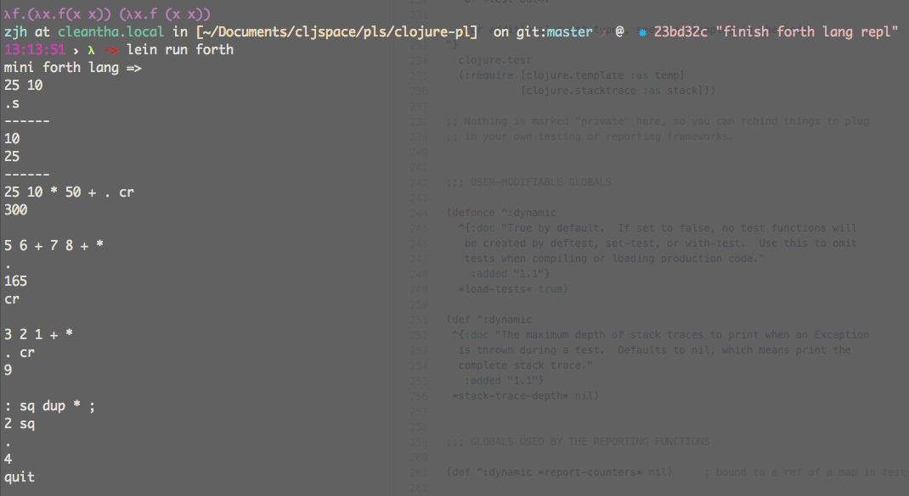

## clojure-pl the clojure part of pls

* [brainfuck](https://en.wikipedia.org/wiki/Brainfuck)

```
lein run bf
```

* [forth lang](https://en.wikipedia.org/wiki/Forth_(programming_language))

```
lein run forth
```



* [l-system](https://en.wikipedia.org/wiki/L-system)

```
lein run lsystem
```

* check UT

```
lein test
```